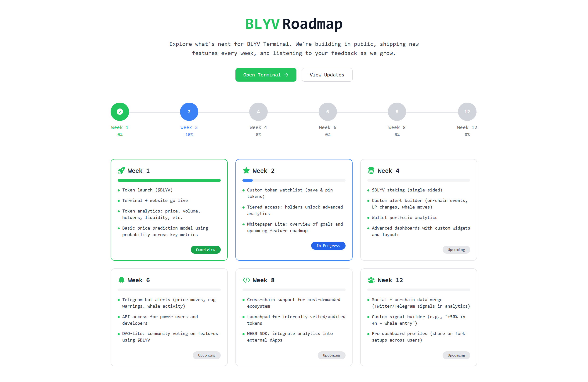

# BLYV Terminal

BLYV Terminal is a full-stack web application for exploring Solana tokens, viewing live trades, analyzing charts, and getting AI-powered price predictions. The platform provides a terminal-style interface for users to query Solana token information in real time, with live data from BLYV and Solana Tracker APIs.

## Features

- **Terminal UI**: Search Solana tokens, view live trades, analyze charts, and get instant feedback in a terminal-inspired interface.
- **Live Data**: Fetches token info, price, market cap, 24h volume, and price change from Solana Tracker.
- **Candlestick Charts**: Visualizes token price history using interactive candlestick charts.
- **Clipboard Support**: Easily copy token addresses and creator addresses.
- **Social Links**: Quick access to BLYV resources and social media.
- **Modern Frontend**: Built with React, Tailwind CSS, and Vite for a fast, responsive UI.
- **Express Backend**: Node.js backend handles API requests and securely manages API keys.

## Demo



## Getting Started

### Prerequisites
- Node.js (v16 or above)
- npm

### Clone the Repository
```sh
git clone https://github.com/yourusername/blyv-terminal.git
cd blyv-terminal
```

### Environment Variables
Create a `.env` file in both the `backend` and `frontend` directories as needed. Use the provided `.env.example` as a template and **never commit your real API keys**.

#### Example `backend/.env.example`
```
SOLANA_TRACKER_API_KEY=your-solana-tracker-api-key-here
PORT=4000
```

> **Note:** Do NOT share your real API keys publicly or commit them to version control.

### Install Dependencies
Install backend and frontend dependencies separately:

```sh
cd backend
npm install
cd ../frontend
npm install
```

### Running the App
Start the backend server:
```sh
cd backend
npm start
```

Start the frontend development server:
```sh
cd ../frontend
npm run dev
```

The frontend will be available at [http://localhost:5173](http://localhost:5173) and the backend at [http://localhost:4000](http://localhost:4000).

## Project Structure
```
BLYV v1/
├── backend/
│   ├── index.js
│   ├── package.json
│   ├── .env.example
├── frontend/
│   ├── src/
│   │   ├── components/
│   │   │   ├── Terminal.jsx
│   │   │   ├── TokenDashBoard.jsx
│   │   ├── index.css
│   ├── index.html
│   ├── package.json
│   ├── tailwind.config.js
│   ├── vite.config.js
```

## Website Content

BLYV Terminal is your gateway to the Solana ecosystem. Search tokens, analyze live market data, and visualize price trends—all in a sleek, terminal-inspired UI. Whether you're a trader, developer, or enthusiast, BLYV Terminal gives you the tools to explore and research Solana tokens with confidence.

- **Instant Token Lookup**: Enter a Solana token address to get live stats, price, and chart.
- **Secure**: Your API keys are never exposed to the browser.
- **Open Source**: Contributions are welcome!

## Contributing
Pull requests are welcome! For major changes, please open an issue first to discuss what you would like to change.

## License
This project is licensed under the MIT License.

---

**BLYV Terminal** — Always DYOR (Do Your Own Research)!
